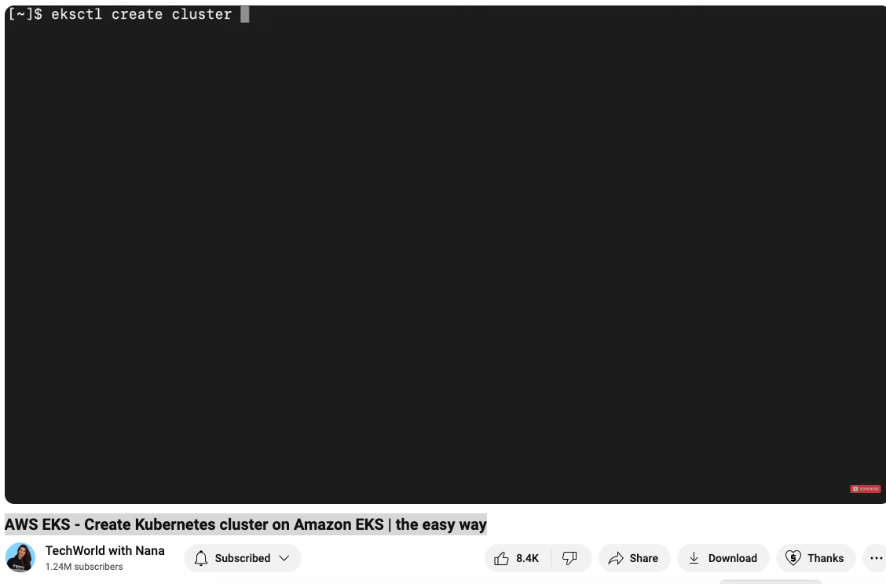

AWS EKS - Create Kubernetes cluster on Amazon EKS | the easy way
- EKS
    - What is EKS
    - How to use EKS
    - Demo: Creating a Kubernetes Cluster with EKS

What is EKS?

 - Managed Kubernetes Service
   - AWS Manages Master Nodes
   - Installs Necessary apps pre-installed
     - Container Runtime
     - Master Process
  - Scaling and Backups

User will only create worker Nodes

How to use EKS?
- Step 1 | Setup or Preparation Steps
 - Create AWS Account
 - Create a VPC
 - Create an IAM Role wit Security Groups
 - 

 - 

- Step 2: Create Cluster Control Plane
  - choose cluster name, k8s version
  - choose region and VPC for your cluster
  - set security for your cluster

-Step 3: Create as a Node Group ( group of Nodes
Choose Cluster it will attach to 
Define Security Group select instance type and resource)

 kubectl

 

 
 

 

 

 

 
 
 
 
 
 
 
 
 
 
 
 
 
 
 
 
 
 
 